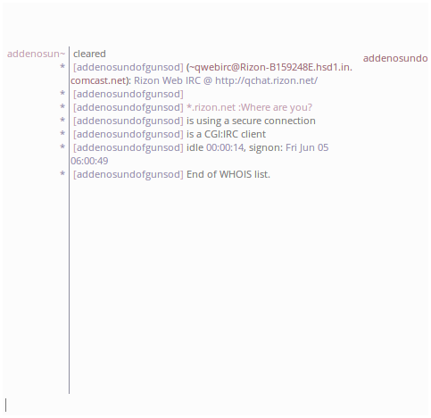

# Hexscripts
Miscellaneous Hexchat scripts I've found some need for or felt like updating.
###Trimmer
######If you want to use the "TabXHider" script alongside this, you **must** install the Python 3 plugin during installation. Using both with the Python 2 plugin will cause a crash.
Shortens extremely long usernames. Yes, I'm looking at you, "aaaaaaaaAAAAAaaaaaaa".

Custom cut-off length, optional "cap" character.

###TabXHider
######Updated to work with both Python 2 and 3 plugin. There are incompatibilities; see [Trimmer](https://github.com/migwu/Hexscripts#trimmer) for details.
Removes the ugly "Close tab" button from the channel tab view.

